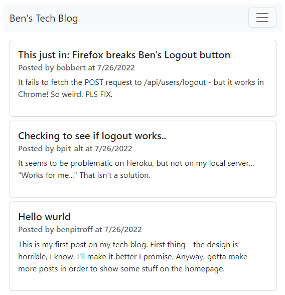
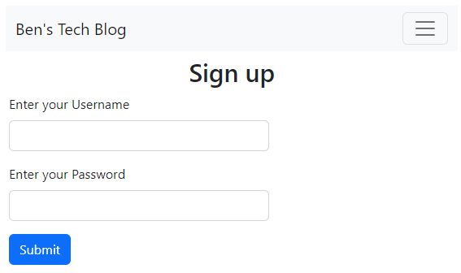
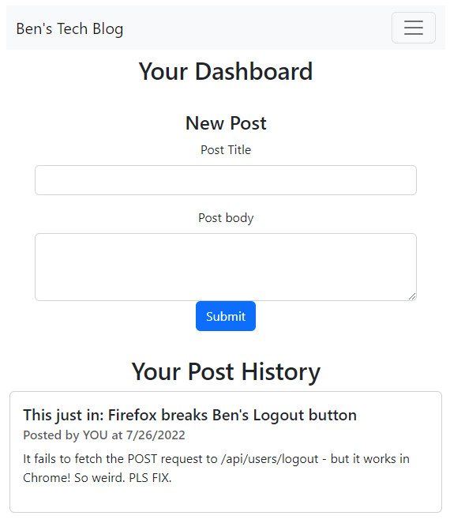

# Ben's Tech Blog

   [](https://opensource.org/licenses/MIT)

  ## Description
  This is a techblog style website that demonstrates my ability to build a database backend with mysql and sequelize that stores data for express.js to serve pages utilizing handlebars. Tech used: node, express, handlebars, mysql, sequelize, dotenv, and others. You can sign up, post your own blog post, and even comment on other posts (as long as you are signed in).

  ## [Live page here](https://chicken-1991-tech-blog.herokuapp.com/)

  * * * * * *


  ## Table of Contents
  1. [Description](#Description)
  2. [Installation](#Installation)
  3. [Usage](#Usage)
  4. [How to Contribute](#contribute)
  5. [Tests](#Tests)
  6. [Questions](#questions)
  7. [License](#License)

  * * * * * *

  <a name="Installation"></a>
  ## Installation
  Requirements: node, mysql - Clone repo, run npm i, enter mysql shell and "SOURCE db/schemal.sql", npm run seed, then node server.js (or nodemon if you have it)

  <a name="Usage"></a>
  ## Usage
  Once the server is running (or you visit my LIVE PAGE), sign up and start posting!

  

  * * * * * *

   

  * * * * * *

   

  * * * * * *

  
  <a name="Contribute"></a>
  ## How to Contribute
  If you want to contribute, please reach out via email or github!

  <a name="questions"></a>
  ## Questions
  For any questions, contact me at dev@chicken1991.anonaddy.com and [visit my github profile](https://github.com/chicken1991).

  <a name="License"></a>
  ## License


```md
COPYRIGHT 2022 Ben Pitroff
Permission is hereby granted, free of charge, to any person obtaining a copy of this software and associated documentation files (the "Software"), to deal in the Software without restriction, including without limitation the rights to use, copy, modify, merge, publish, distribute, sublicense, and/or sell copies of the Software, and to permit persons to whom the Software is furnished to do so, subject to the following conditions:

The above copyright notice and this permission notice shall be included in all copies or substantial portions of the Software.

THE SOFTWARE IS PROVIDED "AS IS", WITHOUT WARRANTY OF ANY KIND, EXPRESS OR IMPLIED, INCLUDING BUT NOT LIMITED TO THE WARRANTIES OF MERCHANTABILITY, FITNESS FOR A PARTICULAR PURPOSE AND NONINFRINGEMENT. IN NO EVENT SHALL THE AUTHORS OR COPYRIGHT HOLDERS BE LIABLE FOR ANY CLAIM, DAMAGES OR OTHER LIABILITY, WHETHER IN AN ACTION OF CONTRACT, TORT OR OTHERWISE, ARISING FROM, OUT OF OR IN CONNECTION WITH THE SOFTWARE OR THE USE OR OTHER DEALINGS IN THE SOFTWARE.
```        


[License: MIT](https://opensource.org/licenses/MIT)
